# Let It Snow - Architecture

Обновлено: 12 февраля 2026

## Диаграмма архитектуры

```mermaid
graph TB
    subgraph Browser["🌐 Browser Environment"]
        WebPages["📄 Web Pages"]
    end

    subgraph ContentScript["🎬 Content Script Layer"]
        MainContent["content/index.js<br/>Main orchestrator"]
        
        subgraph Renderers["🎨 Rendering Engines"]
            WebGPU["webgpu-renderer.js<br/>Primary renderer"]
            Fallback2D["fallback-2d-renderer.js<br/>Canvas fallback"]
            Shader["shader.wgsl<br/>GPU shader"]
            GIFLayer["gif-layer.js<br/>GIF overlay support"]
        end
        
        subgraph Utils["🛠️ Utilities"]
            BgMonitor["background-monitor.js<br/>Background detection"]
            ColorUtils["color-utils.js<br/>Color processing"]
            GlyphUtils["glyph-utils.js<br/>Text rendering"]
        end
    end

    subgraph PopupUI["⚙️ Extension Popup"]
        PopupMain["popup.js<br/>Main logic"]
        PopupHTML["popup.html<br/>UI structure"]
        PopupCSS["popup.css<br/>Styling"]
        Settings["settings.js<br/>Settings manager"]
        UIControllers["ui-controllers.js<br/>UI interactions"]
        Localization["localization.js<br/>i18n handler"]
    end

    subgraph Storage["💾 Persistent Storage"]
        BrowserStorage["Browser Storage API<br/>Settings & State"]
    end

    subgraph Config["📋 Configuration"]
        Manifest["manifest.json<br/>Base config"]
        ManifestChrome["manifests/manifest.chrome.json"]
        ManifestEdge["manifests/manifest.edge.json"]
        ManifestFirefox["manifests/manifest.firefox.json"]
        LocaleEN["_locales/en/messages.json"]
        LocaleRU["_locales/ru/messages.json"]
    end

    subgraph Assets["🎨 Static Assets"]
        Icons["icons/*<br/>Extension icons"]
        OtherAssets["assets/*<br/>Other resources"]
    end

    WebPages -->|Injected into| MainContent
    MainContent -->|Uses| WebGPU
    MainContent -->|Falls back to| Fallback2D
    MainContent -->|Overlays| GIFLayer
    WebGPU -.->|Uses| Shader
    MainContent -.->|Uses| Utils
    
    PopupMain -->|Manages| Settings
    PopupMain -->|Controls| UIControllers
    PopupMain -.->|Uses| Localization
    Settings <-->|Read/Write| BrowserStorage
    MainContent -.->|Reads| BrowserStorage
    
    Localization -.->|Loads| LocaleEN
    Localization -.->|Loads| LocaleRU
    
    PopupHTML -.->|Styles| PopupCSS
    PopupHTML -->|Script| PopupMain
    
    Manifest -->|Extends| ManifestChrome
    Manifest -->|Extends| ManifestEdge
    Manifest -->|Extends| ManifestFirefox
    
    Config -.->|Defines| Icons
    Config -.->|References| OtherAssets

    classDef primary fill:#4A90E2,stroke:#2E5C8A,color:#fff
    classDef secondary fill:#F5A623,stroke:#C67E00,color:#fff
    classDef storage fill:#BD10E0,stroke:#7B0A94,color:#fff
    classDef config fill:#50E3C2,stroke:#2BA68B,color:#000
    classDef utility fill:#B8E986,stroke:#7BA857,color:#000
    
    class MainContent,WebGPU,Fallback2D primary
    class PopupMain,Settings,UIControllers secondary
    class BrowserStorage storage
    class Manifest,ManifestChrome,ManifestEdge,ManifestFirefox config
    class Utils,BgMonitor,ColorUtils,GlyphUtils,Localization utility
```

## Основные компоненты

### Content Script Layer
- **content/index.js** - главный оркестратор, управляет инъекцией снега на веб-страницы
- **webgpu-renderer.js** - основной рендерер, использующий WebGPU для аппаратного ускорения
- **fallback-2d-renderer.js** - резервный Canvas 2D рендерер для браузеров без WebGPU
- **shader.wgsl** - WGSL шейдер для GPU рендеринга
- **gif-layer.js** - слой для поддержки GIF-оверлея

#### Утилиты
- **background-monitor.js** - мониторинг фона страницы для адаптивного рендеринга
- **color-utils.js** - обработка и конвертация цветов
- **glyph-utils.js** - рендеринг текстовых символов (снежинок)

### Extension Popup
- **popup.html/js/css** - пользовательский интерфейс расширения
- **settings.js** - менеджер настроек
- **ui-controllers.js** - контроллеры UI взаимодействий
- **localization.js** - обработка интернационализации

### Configuration
- **manifest.json** - базовая конфигурация
- **manifests/** - специфичные манифесты для Chrome, Edge, Firefox
- **_locales/** - файлы локализации (en, ru)

### Storage
- Browser Storage API для хранения настроек и состояния

## Поток данных

1. **Инъекция**: Content script инъецируется в веб-страницы
2. **Инициализация**: Выбирается подходящий рендерер (WebGPU или Canvas 2D)
3. **Рендеринг**: Снег отрисовывается с использованием выбранного движка
4. **Конфигурация**: Popup UI позволяет настраивать параметры
5. **Персистентность**: Настройки сохраняются в Browser Storage

## Условные обозначения

- **Сплошные линии (→)**: Прямое взаимодействие
- **Пунктирные линии (-.→)**: Опциональное/внутреннее использование
- **Двусторонние стрелки (↔)**: Чтение и запись данных
